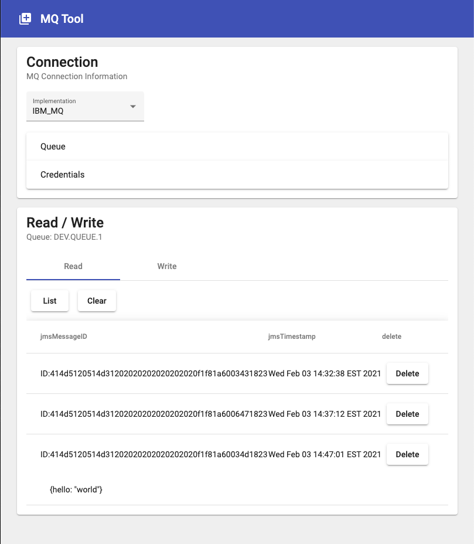

MQ Tool
=======

SUMMARY
-------

This is a very simple web application for performing basic operations on a queue.

GETTING STARTED
---------------

* Start the message broker
```shell
docker-compose up
```
* Start the app
```shell
./mvnw spring-boot:run
```
* Open your web browser and navigate to `localhost:7070/`



SUCCESS!

COMMANDS
--------

Pull a message
```http request
# curl -v 'localhost:7070/message/{jmsId}?host=localhost&port=1414&channel=DEV.ADMIN.SVRCONN&qm=QM1&userId=admin&password=passw0rd&queue=DEV.QUEUE.1'
GET localhost:7070/message/{jmsId}?host=localhost&port=1414&channel=DEV.ADMIN.SVRCONN&qm=QM1&userId=admin&password=passw0rd&queue=DEV.QUEUE.1
```

Get stats
```http request
# curl -v 'localhost:7070/message/stats?host=localhost&port=1414&channel=DEV.ADMIN.SVRCONN&qm=QM1&userId=admin&password=passw0rd&queue=DEV.QUEUE.1'
GET localhost:7070/message/stats?host=localhost&port=1414&channel=DEV.ADMIN.SVRCONN&qm=QM1&userId=admin&password=passw0rd&queue=DEV.QUEUE.1
```

List messages
```http request
# curl -v 'localhost:7070/message/list?size=1&host=localhost&port=1414&channel=DEV.ADMIN.SVRCONN&qm=QM1&userId=admin&password=passw0rd&queue=DEV.QUEUE.1'
GET localhost:7070/message/list?size=1&host=localhost&port=1414&channel=DEV.ADMIN.SVRCONN&qm=QM1&userId=admin&password=passw0rd&queue=DEV.QUEUE.1
```

Push a message
```http request
# curl -v -d '{"host":"localhost", "port":1414, "channel":"DEV.ADMIN.SVRCONN", "qm":"QM1", "userId":"admin", "password":"passw0rd", "queue":"DEV.QUEUE.1", "body":"test body"}' -H "Content-Type: application/json" -X POST http://localhost:7070/message
POST http://localhost:7070/message
Content-Type: application/json

{"host":"localhost", "port":1414, "channel":"DEV.ADMIN.SVRCONN", "qm":"QM1", "userId":"admin", "password":"passw0rd", "queue":"DEV.QUEUE.1", "body":"test body"}
```
